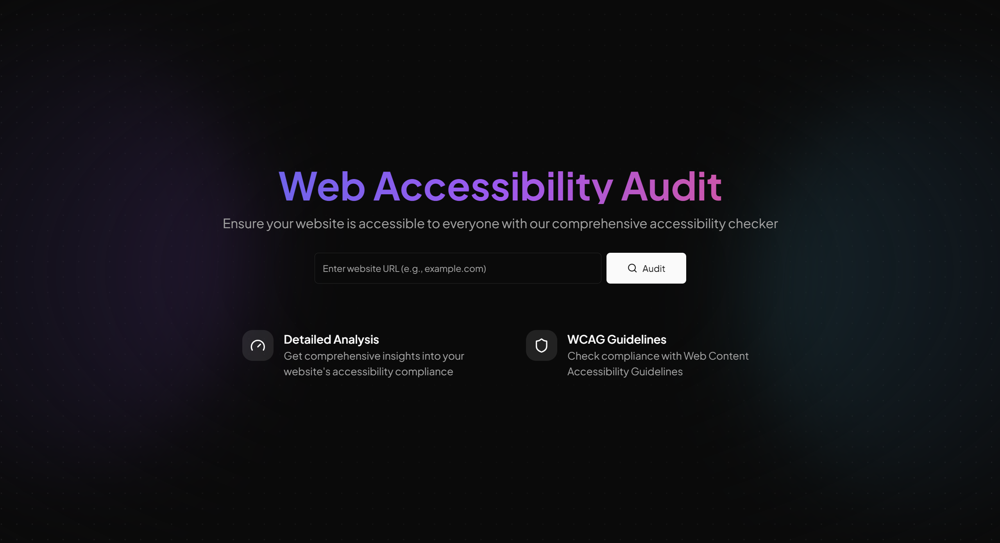
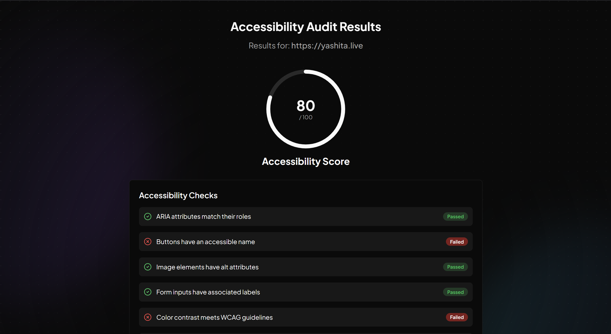

# Accessibility Auditor 🛠️

[](https://nextjs.org/)
[](https://www.typescriptlang.org/)
[](https://vercel.com)
[](https://www.w3.org/WAI/standards-guidelines/wcag/)
[](LICENSE)
[](https://github.com/YashitaCodes/access-sure/issues)
[](https://github.com/YashitaCodes/access-sure/stargazers)

A lightweight, TypeScript-based **accessibility auditing tool** built on Next.js to assess web content for WCAG compliance and other accessibility standards.

## Key Features

- **ARIA Attributes**: Ensures all roles match their ARIA attributes.
- **Button Accessibility**: Checks that all buttons have accessible names.
- **Image Alt Text**: Verifies that all images have descriptive `alt` attributes.
- **Form Labels**: Confirms that all form inputs have associated labels.
- **Color Contrast**: Meets WCAG contrast guidelines for readability.
- **Keyboard Accessibility**: Guarantees all interactive elements are fully keyboard accessible.
- **Logical Headings**: Ensures headings follow a structured order.
- **No Auto-Playing Media**: Enforces no autoplay for any media elements.

## Quick Demo

The home page provides a streamlined search bar for easy page access:



Upon searching a page URL, Accessibility Auditor displays the results of the audit, as shown below:



### Get Started
To clone and run this locally, follow these steps:

```bash
git clone https://github.com/YashitaCodes/access-sure.git
cd access-sure
npm install
npm run dev
```
